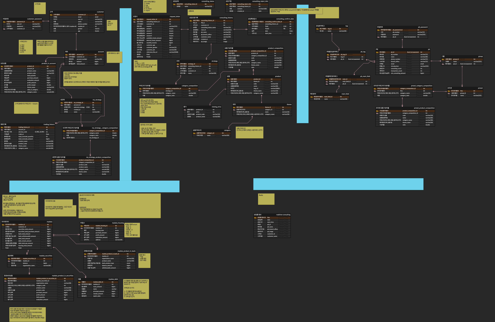

# Pickle(PB Click, PB 클났다)

## 시연영상 👉🏻 [추후 업로드]()

## 📅 프로젝트 개요

💵 **기간**

2024.08.02 ~ 2024.09.11 - 기획 및 개발

💵 **Pizza 팀원 소개**

<table>
    <tr>
        <td></td>
        <td></td>
        <td></td>
        <td></td>
        <td></td>
        <td></td>
    </tr>
    <tr align=center>
        <td><a href='https://github.com/gariguri'>김가언</a></td>
        <td><a href='https://github.com/Nahyeonnnn'>김나현</a></td>
        <td><a href='https://github.com/colde99'>박찬란</a></td>
        <td><a href='https://github.com/sooyeon-kr'>오수연</a></td>
        <td><a href='https://github.com/yoonjaeuk'>윤재욱</a></td>
        <td><a href='https://github.com/OneK-2'>이원규</a></td>
    </tr>
</table>

💵 **기획 배경**

최근, 자산 관리에 대한 관심이 급증하고 있습니다.  
이에 따라, 고액 자산가뿐만 아니라, _**중액 및 소액 자산가**_ 역시 `투자상담`부터 `상품선정`과 `투자진행` 및 `성과관리` 까지 도맡아 줄 `자산운용가(PB)`를 만나고 싶어합니다.

그러나, 현재 이러한 _**사설 자산 운용가(PB)**_ 는 주로 고액 자산가 고객의 자산 관리에 집중하고 있기 때문에, 공개된 PB정보가 많지 않아 접근장벽이 높습니다.

이에 따라, _**고액의 자산을 가지지 않았을 경우**_, 투자 상담을 위해 `전화`나 `채팅`을 통한 `디지털 PB 서비스`를 이용하게 됩니다.

저희는 현재 서비스처럼 온라인으로 상담을 받으면서도, 지금보다 더 `고객과 PB, 양측 모두 지금보다 더 효율적인 Win-Win할 수 있는 서비스가 될 수는 없을까?` 라는 고민을 했습니다.

다음과 같이, 
1. `PB 프로필`, `상담 예약`, `실시간 상담`을 통해 성향에 맞는 PB를 선택하고, 선택한 PB와 신뢰를 형성하며,
2. PB는 `마이데이터`를 활용하여 상품 추천을 통해 고객을 유치하고,
3. 고객은 `맞춤형 투자 자문`을 받아, `상품 투자`까지 할 수 있는,

Pickle(PB Click, 피비 클났다)을 기획했습니다.


> PB와 함께, **시간적, 공간적** 제약없이 **높은 수익률을 가져갈 수 있는 전략**을 짜보세요!


💵 **주요 기능**
- 고객
    - 회원가입/로그인
    - 마이데이터 가입 및 동의
    - 마이데이터 조회
    - PB 프로필 조회
    - 상담 요청서 작성
        - PB 선택
        - 날짜 선택
        - 마이데이터 중 첨부할 데이터 선택
        - 설문 및 요청사항 작성
    - 실시간 상담
        - 비디오 및 음성 공유
        - 채팅
    - 전략관리
    - 투자하기

- PB
    - 회원가입/로그인
    - 상담 관리
        - 상담 수락
        - 상담 거절
    - 프리셋 관리
        - 그룹 관리
            - 그룹 생성 및 삭제
        - 프리셋 작성 및 삭제
    - 실시간 상담
        - 화면 공유
        - 비디오 및 음성 공유
        - 채팅
        - 전략 확정

💵 **데이터 원천 및 활용**
-  _toss WTS_ 크롤링.  
프리셋 및 전략 구성을 위한 `주식 종목 검색`
-   _한국투자증권 openAPI_ 활용.  
주식 매매 및 포트폴리오 시세 조회를 위한 `종목 시세 조회`
-   _네이버 증권 데이터_ 및 _yahoo finance_  활용.  
 국내 및 해외 주식과 ETF를 백테스팅한 `과거 투자 성과 조회`


## 💡서비스 소개

### _Pickle(피클)_

Pickle(피클)은, 비대면 투자 전략 컨설팅 플랫폼 서비스입니다.

> (중액 및 소액 투자자)

1. `마이데이터` 가입에  `동의`합니다.  
   (사전에 만들어놓은 데이터와 고객 정보를 연결시킵니다.)

2. 메인페이지에서, `마이데이터`를 확인할 수 있습니다.
   (은행, 증권, 부동산, 대출 등)

3. `PB 프로필`을 보며, 자신의 성향과 맞는 PB를 선택하고, `상담받을 날짜`를 지정한 뒤 `요청서 작성`을 클릭합니다.

4. 요청서에는 `마이데이터`와 `투자 요구사항`을 작성합니다. 마이데이터는 모두 첨부하는 것이 아니라, 첨부할 의사가 있는 데이터만을 선택하여 전송합니다. 

5. 상담이 수락되면, 요청한 상담 일시에 `실시간 상담룸`에 입장하여 상담을 받고 PB가 사전에 만들어온 프리셋을 바탕으로 함께 `전략을 만들어 나갑니다`.

6. 상담이 끝난 후, `전략을 바탕으로` 투자하고 싶다면 투자하기 버튼을 눌러 일괄적으로 `투자를 진행`합니다.

> (PB)

1.  상담관리 페이지에서, 상담을 수락하거나 거절합니다.

2.  `수락한 상담`에 대해서는, 고객이 요청한 정보들을 바탕으로 `프리셋`을 만듭니다.

3.  고객이 요청했던 상담 일시가 되면, `실시간 상담룸`에 입장하여 상담을 진행합니다. 이 때, `화면을 공유`하여 프리셋을 바탕으로 `전략을 함께 만듭니다`.

4.  고객이 만족하는, 전략이 완성된다면, `만들기 버튼`을 눌러 고객에게 `전략을 전송`합니다.

**Pickle(피클)을 통해 투자 전략을 만들어보세요!*
### ⚙️ 기술 스택

#### 프론트엔드


#### 백엔드
> 메인 & 마이데이터 서버(Spring), 백테스팅(Python) 시세서버(Node.js), 상담서버(Node.js)로 구성

 


  


  


#### 인프라


#### 협업툴


## 📂 ERD 및 시스템 아키텍처 
**ERD**


**시스템 아키텍처**


  
## 🖼 주요 화면
> 리팩토링 후 업로드 할 예정으로, 리팩토링은 https://github.com/sooyeon-kr/Pickle-Backend 와 https://github.com/sooyeon-kr/Pickle-Frontend 에서 진행하고 있습니다.

## 컨벤션
### 📍 Git PR 컨벤션
**PR 타입**  
-[] 기능 추가  
-[] 기능 수정  
-[] 기능 삭제  
-[] 버그 수정  
-[] 의존성, 환경 변수, 빌드 관련 코드 업데이트

**반영 브랜치**  
ex) feat/login -> dev

**변경 사항**  
ex) 로그인 시, 구글 소셜 로그인 기능을 추가했습니다.

**테스트 결과**  
ex) 베이스 브랜치에 포함되기 위한 코드는 모두 정상적으로 동작해야 합니다. 결과물에 대한 스크린샷, GIF, 혹은 라이브 데모가 가능하도록 샘플API를 첨부할 수도 있습니다.


### 📍 Git Commit 컨벤션

```
<컨벤션> : <설명>
```

| 컨벤션   | 설명                                                                                                                            |
| -------- | ------------------------------------------------------------------------------------------------------------------------------- |
| feat     | 새로운 기능과 관련된 것을 의미한다.                                                                                             |
| fix      | 오류와 같은 것을 수정했을 때 사용한다.                                                                                          |
| docs     | 문서와 관련하여 수정한 부분이 있을 때 사용한다.                                                                                 |
| style    | 코드의 변화와 관련없는 포맷이나 세미콜론을 놓친 것과 같은 부분들을 의미한다.                                                    |
| refactor | 코드의 리팩토링을 의미한다.                                                                                                     |
| test     | test를 추가하거나 수정했을 때를 의미한다.                                                                                       |
| chore    | build와 관련된 부분, 패키지 매니저 설정 등 여러가지 production code와 무관한 부분 들을 의미한다. 말 그대로 자질구레한 일들이다. |
| add      | 이미지 등의 정적 자원 추가를 의미한다.                                                                                          |
| init     | 초기 설정 세팅을 의미한다.                                                                                                      |
| rename   | 파일 혹은 폴더 명을 수정하거나 옮기는 작업을 의미한다.                                                                          |
